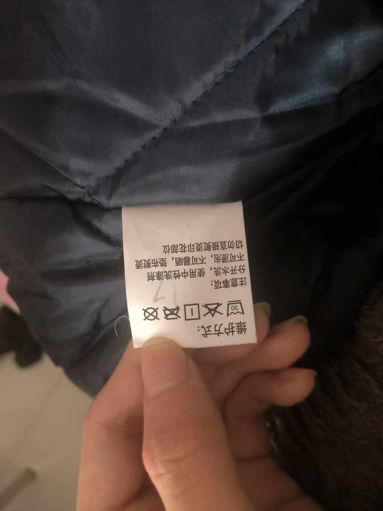
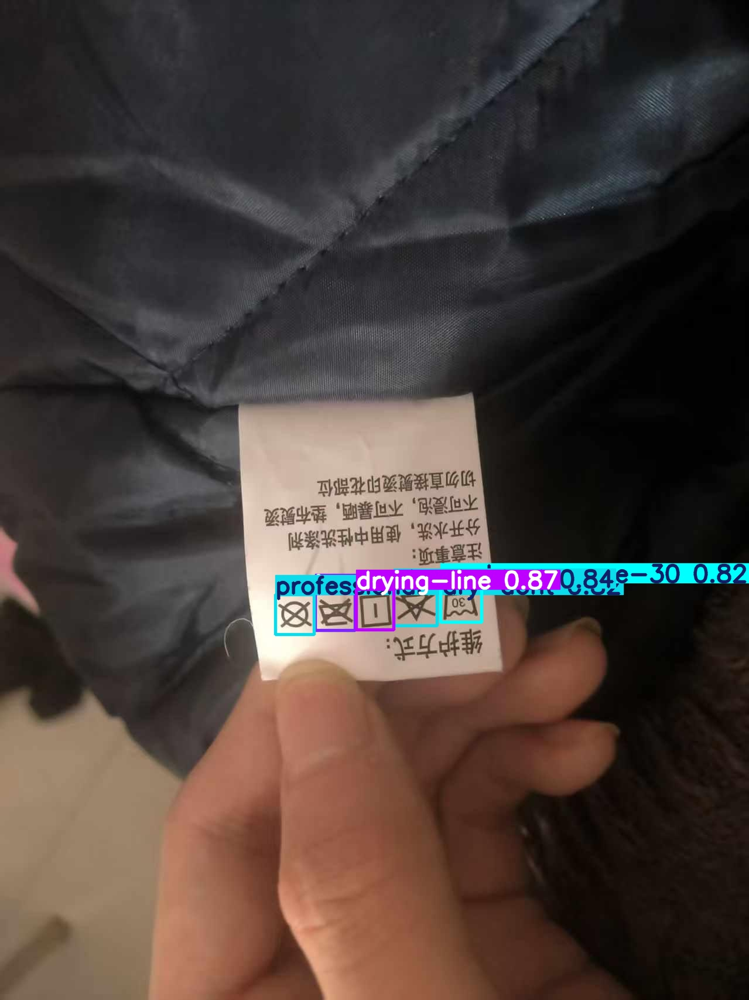
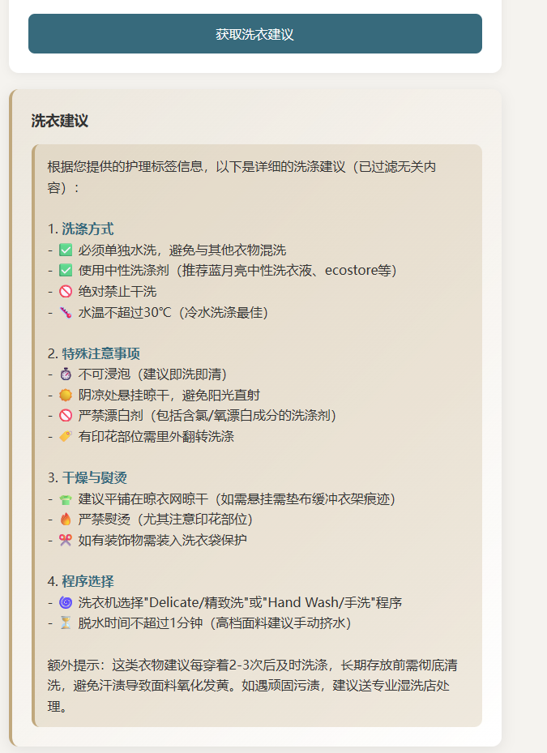

```markdown
# 洗衣助手 - 后端服务

## 项目简介

洗衣助手后端服务，提供基于 OCR 的水洗标文字识别、YOLO 水洗标符号检测以及 AI 洗衣建议对话功能。

## 技术栈

### Java 后端
- Spring Boot
- Java 17+
- Maven/Gradle

### Python 检测服务
- Flask
- Ultralytics YOLO
- Pillow

## 项目结构

```
LaundryHelper/
├── src/main/java/com/xioahei/laundryhelper/
│   ├── Service/
│   │   └── Service.java          # 业务服务层
│   └── Utils/
│       └── ApiUtil.java           # API 调用工具类
├── yoloapi/
│   └── api.py             # YOLO 水洗标检测服务
├── application.properties         # 配置文件
└── docs/
└── images/                    # 效果图存放目录
```

## 环境要求

### Java 后端
- JDK 17 或更高版本
- Maven 3.6+ 或 Gradle 7.0+

### Python 服务
- Python 3.8+
- 依赖包：flask, ultralytics, Pillow, requests

## 配置说明

### application.properties

```properties
# LLM API 配置（OCR + 对话）
api.llm.url=https://api.siliconflow.cn/v1/chat/completions
api.llm.key=your_api_key_here

# YOLO 服务地址
api.yolo.url=http://127.0.0.1:5000/predict/base64
```

### 水洗标符号映射文件

```properties
# 漂白符号
bleach-allowed=允许漂白 (可使用任何漂白剂)
bleach-dont=不可漂白
bleach-oxygen=允许氧漂 (可使用氧系漂白剂/非氯漂)

# 干燥符号
drying-drip=滴干
drying-drip-shade=阴凉处滴干
drying-flat=平铺晾干
drying-flat-drip=平铺滴干
drying-flat-drip-shade=阴凉处平铺滴干
drying-flat-shade=阴凉处平铺晾干
drying-line=悬挂晾干
drying-line-alt=悬挂晾干
drying-line-drip=悬挂滴干
drying-line-drip-shade=阴凉处悬挂滴干
drying-line-shade=阴凉处悬挂晾干
drying-line-shade-alt=阴凉处悬挂晾干

# 熨烫符号
iron-dont=不可熨烫
iron-high=可高温熨烫 (最高200℃)
iron-low=可低温熨烫 (最高110℃)
iron-medium=可中温熨烫 (最高150℃)

# 机洗符号
machine-wash=可机洗
machine-wash-permanent-press=可机洗 (免烫洗程序)

# 水温洗涤符号
wash-30=最高洗涤温度30℃
wash-40=最高洗涤温度40℃
wash-50=最高洗涤温度50℃
wash-60=最高洗涤温度60℃
wash-70=最高洗涤温度70℃
wash-90=最高洗涤温度90℃
wash-95=最高洗涤温度95℃
wash-dont=不可水洗
wash-hand=仅可手洗

# 干洗符号
professional-dry-dont=不可干洗
professional-dry-f=专业干洗 (碳氢化合物溶剂)
professional-dry-p=专业干洗 (四氯乙烯和碳氢化合物溶剂)

# 烘干符号
tumble-dry-dont=不可转笼烘干
tumble-dry-low=可使用转笼烘干 (低温)
tumble-dry-medium=可使用转笼烘干 (中温)
```

## 快速开始

### 1. 启动 Python YOLO 水洗标检测服务

```bash
cd python-service
pip install flask ultralytics pillow requests
python yolo_server.py
```

服务将在 `http://127.0.0.1:5000` 启动。

### 2. 启动 Spring Boot 后端

```bash
mvn spring-boot:run
# 或
./gradlew bootRun
```

## 识别效果展示

### 步骤1：上传水洗标原图



*图：用户拍摄的衣物水洗标照片*

### 步骤2：YOLO 符号检测



*图：YOLO 模型自动识别并标注水洗标中的各个符号*

**检测输出示例：**
```
检测到 6 个洗涤符号：
- machine-wash (可机洗) - 置信度: 0.96
- wash-40 (最高洗涤温度40℃) - 置信度: 0.94
- bleach-dont (不可漂白) - 置信度: 0.92
- iron-medium (可中温熨烫) - 置信度: 0.89
- drying-line (悬挂晾干) - 置信度: 0.91
- tumble-dry-dont (不可转笼烘干) - 置信度: 0.88
```

### 步骤3：OCR 文字识别


*图：OCR 识别水洗标上的文字信息*

**文字识别输出示例：**
```
面料成分：100%棉
洗涤说明：不可漂白，中温熨烫
产地：中国
```

### 步骤4：AI 综合解读



*图：前端展示最终的水洗标解读结果*

**AI 生成建议：**
```
根据水洗标识别结果，建议如下：

🧼 洗涤方式：可机洗，最高水温40℃
🚫 漂白：不可使用任何漂白剂
🔥 熨烫：中温熨烫（最高150℃）
🌬️ 干燥：悬挂晾干，不可使用烘干机
```

## API 接口

### Java 后端服务接口

| 方法 | 功能 | 返回值示例 |
|------|------|------------|
| `OCR(base64Image)` | 识别水洗标上的文字 | `"100%棉 不可漂白 中温熨烫"` |
| `YOLO(base64Image)` | 检测水洗标符号 | `"machine-wash,wash-40,bleach-dont"` |
| `Msg(msg)` | AI 洗衣建议 | `"建议使用40℃温水洗涤，不可漂白..."` |

### Python YOLO 服务接口

#### POST `/predict/base64`
接收 base64 编码的水洗标图片进行符号检测

**请求体：**
```json
{
    "image_base64": "base64编码的图片数据"
}
```

**响应：**
```json
{
    "success": true,
    "detections_count": 6,
    "detections": [
        {
            "target_id": 1,
            "class_name": "machine-wash",
            "confidence": 0.96,
            "bbox": {"x1": 50.0, "y1": 30.0, "x2": 100.0, "y2": 80.0}
        },
        {
            "target_id": 2,
            "class_name": "wash-40",
            "confidence": 0.94,
            "bbox": {"x1": 120.0, "y1": 30.0, "x2": 170.0, "y2": 80.0}
        }
    ]
}
```

## 使用示例

### Java 调用示例

```java
@Autowired
private Service service;

// 1. 上传水洗标图片并识别
String base64Image = encodeImageToBase64("wash_label.jpg");

// 2. OCR识别文字
String text = service.OCR(base64Image);
System.out.println("文字识别: " + text);
// 输出: 文字识别: 100%棉 不可漂白 中温熨烫

// 3. YOLO识别符号
String symbols = service.YOLO(base64Image);
System.out.println("符号识别: " + symbols);
// 输出: 符号识别: 可机洗,最高洗涤温度40℃,不可漂白

// 4. AI综合建议
String advice = service.Msg("水洗标显示：40℃机洗，不可漂白，中温熨烫");
System.out.println("洗衣建议: " + advice);
// 输出: 洗衣建议: 建议使用40℃温水、中性洗涤剂清洗...
```

### 前端 JavaScript 调用示例

```javascript
// 上传水洗标并解读
async function analyzeWashLabel(imageFile) {
    const base64 = await fileToBase64(imageFile);
    
    const response = await fetch('/api/analyze', {
        method: 'POST',
        headers: { 'Content-Type': 'application/json' },
        body: JSON.stringify({ image: base64 })
    });
    
    const result = await response.json();
    
    // 展示识别结果
    displaySymbols(result.symbols);  // 符号识别
    displayText(result.text);        // 文字识别
    displayAdvice(result.advice);    // AI建议
}
```

## 水洗标符号大全

| 类别 | 英文标识 | 中文含义 |
|------|----------|----------|
| **漂白** | bleach-allowed | 允许漂白 |
| | bleach-dont | 不可漂白 |
| | bleach-oxygen | 允许氧漂 |
| **干燥** | drying-line | 悬挂晾干 |
| | drying-flat | 平铺晾干 |
| | drying-drip | 滴干 |
| | drying-line-shade | 阴凉处悬挂晾干 |
| **熨烫** | iron-low | 低温熨烫 (110℃) |
| | iron-medium | 中温熨烫 (150℃) |
| | iron-high | 高温熨烫 (200℃) |
| | iron-dont | 不可熨烫 |
| **洗涤** | machine-wash | 可机洗 |
| | wash-30 | 最高30℃洗涤 |
| | wash-40 | 最高40℃洗涤 |
| | wash-60 | 最高60℃洗涤 |
| | wash-hand | 仅可手洗 |
| | wash-dont | 不可水洗 |
| **干洗** | professional-dry-p | 专业干洗 |
| | professional-dry-f | 碳氢干洗 |
| | professional-dry-dont | 不可干洗 |
| **烘干** | tumble-dry-low | 低温烘干 |
| | tumble-dry-medium | 中温烘干 |
| | tumble-dry-dont | 不可烘干 |

## 环境变量

| 变量名 | 说明 | 默认值 |
|--------|------|--------|
| `api.llm.url` | LLM API 地址 | - |
| `api.llm.key` | API 密钥 | - |
| `api.yolo.url` | YOLO 服务地址 | http://127.0.0.1:5000/predict/base64 |

## 注意事项

1. **YOLO 模型文件**：需要将训练好的水洗标识别模型 `label.pt` 放置在 Python 服务目录下
2. **API 密钥**：需要有效的 LLM API 密钥（如 SiliconFlow、DeepSeek 等）
3. **拍摄建议**：拍摄水洗标时请确保光线充足、文字清晰
4. **图片大小**：建议上传图片小于 16MB
5. **效果图**：请将实际效果图放入 `docs/images/` 目录

## 常见问题

### Q: YOLO 服务连接失败
A: 检查 Python 服务是否启动，以及配置中的 `api.yolo.url` 是否正确

### Q: 水洗标符号识别不准
A:
- 确保水洗标拍摄清晰、平整
- 调整 `yolo_server.py` 中的 `conf` 参数（默认 0.65）
- 检查模型文件是否正确

### Q: 类别映射中文显示异常
A: 确保 `ClassesMapper.properties` 文件编码为 UTF-8

### Q: OCR 识别文字不准确
A:
- 确保水洗标文字清晰
- 在光线充足的环境下拍摄
- 可手动裁剪图片只保留水洗标区域

## 许可证

[MIT](LICENSE)
```